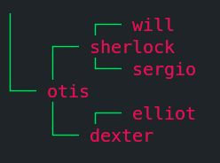
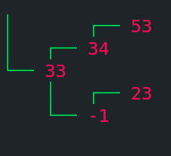
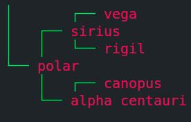

# [Binary-Search-Tree](https://www.theodinproject.com/paths/full-stack-ruby-on-rails/courses/ruby-programming/lessons/binary-search-trees)

  
Table Of Contents

  <ol>
    <li>
      <a href="#description">Description</a>
    </li>
    <li>
      <a href="#applications">Applications</a>
    </li>
    <li>
      <a href="#variations">Variations</a>
    </li>
    <li>
      <a href="#built-with">Built With</a>
    </li>
     <li>
      <a href="#what-i-learned">What I Learned</a>
    </li>
     <li>
      <a href="#acknowledgements">Acknowledgements</a>
    </li>
  </ol>

## Description
>In computer science, a binary search tree (BST), also called an ordered or sorted binary tree, is a rooted binary tree data structure whose internal nodes each store a key greater than all the keys in the node’s left subtree and less than those in its right subtree. A binary tree is a type of data structure for storing data such as numbers in an organized way. Binary search trees allow binary search for fast lookup, addition and removal of data items, and can be used to implement dynamic sets and lookup tables. - [Wikipedia](https://en.wikipedia.org/wiki/Binary_search_tree)

### BST
Binary Search Tree is a data structure where each root node's left subtree contains values lesser than the root node's value and right subtree contains values greater than the root node's value. Binary Search - Where we omit half the size of the problem on each iteration to find the solution. We start from middle of the collection of course. In binary search trees the root node will be the middle element of the collection. The root node's left child will be the middle element of the left half of the collection and the right child will be the middle element of the right half of the collection and it continues recursively until all the nodes are in the tree structure. It will be easier look for values in the binary search tree because every node's value will be greater than the left subtree and lesser than the right subtree.

### Balanced BST
Balanced Binary Search Tree is a Binary Search Tree with the left and right subtrees' height difference must not exceed 1, recursively of course.

### Height and Depth
* Height of a Node in a Binary Search Tree is the number edges from a Node to the farthest leaf it can reach
* Height of tree with 1 node is 0
* Depth of a Node in a Binary Search Tree is the number edges from a root node to the given node
* Depth of a root node is 0
* Height of root node = Height of the tree = Max Depth of the Tree

### Traversal
* Breadth First
  * Level-Order Traversal
* Depth First
  * Pre-Order
  * In-Order
  * Post-Order

### Methods In This Implementation

Method Name  | Description
------------ | -------------
`Node#new` | Creates `New node` contains `data`, `left`, `right`
`Tree#new` | Creates `New BST` with the given `array`
`Tree#insert` | Inserts a `Node` to the `BST`
`Tree#delete` | Deletes a `Node` from the `BST`
`Tree#find` | Finds the `value` from the `BST`
`Tree#level_order` | `Level Order Traversal`
`Tree#preorder` | `Pre Order Traversal`
`Tree#inorder` | `In Order Traversal`
`Tree#postorder` | `Post Order Traversal`
`Tree#balanced?` | Check if the `BST` is balanced or not
`Tree#rebalance` | Rebalance the `BST`
`Tree#to_s` | Prints the `BST`

## Variations
* [AVL Trees](https://en.wikipedia.org/wiki/AVL_tree)
* [Red-Black Trees](https://en.wikipedia.org/wiki/Red%E2%80%93black_tree)

Above are the two common `self-balancing BST`'s, they allow us to optimize the height of `BST`'s with minimum height possible.

## Applications
* Search Algorithms
* Maintaining Sorted Data
* Indexing
* And so on...
  
## Built With
* Ruby

## What I Learned
* About Binary Search Trees
* How to create a Binary Search Tree
* How to use a Binary Search Tree
* Operations on a Binary Search Tree
* Understood recursion much more effectively
* How to approach the problem when we stuck
  
## Acknowledgements
* [The Odin Project](https://theodinproject.com)

[Move To Top](#binary-search-tree)

