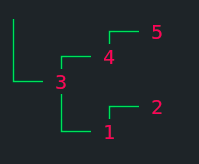
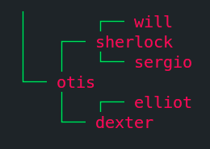

# [Binary-Search-Tree](https://www.theodinproject.com/paths/full-stack-ruby-on-rails/courses/ruby-programming/lessons/binary-search-trees)

  
Table Of Contents

  <ol>
    <li>
      <a href="#description">Description</a>
    </li>
    <li>
      <a href="#applications">Applications</a>
    </li>
    <li>
      <a href="#built-with">Built With</a>
    </li>
     <li>
      <a href="#what-i-learned">What I Learned</a>
    </li>
     <li>
      <a href="#acknowledgements">Acknowledgements</a>
    </li>
  </ol>

## Description

## Applications

  
## Built With
* Ruby

## What I Learned
* 
  
## Acknowledgements
* [The Odin Project](https://theodinproject.com)

[Move To Top](#binary-search-tree)

